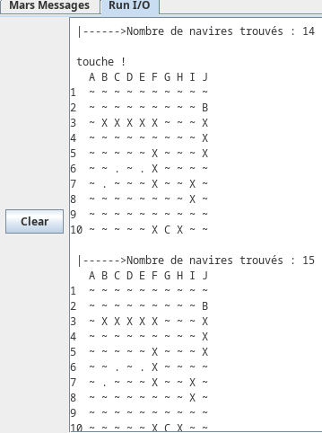

# MipsBattleship

Un simulateur de bataille navale en ligne de commande, écrit en assembleur MIPS32.

## Fonctionnement

Le jeu se déroule de manière entièrement automatique dans la console de l'émulateur. Une grille de 10x10 est d'abord générée et différents navires (Porte-avions, Cuirassé, Croiseur, Sous-marin, Torpilleur) y sont positionnés de manière aléatoire. Ensuite, le programme simule automatiquement les tirs pour tenter de localiser et de couler les navires. La progression et l'état de la grille s'affichent à chaque étape jusqu'à ce que l'ensemble de la flotte soit trouvée.

## Prérequis

Ce projet nécessitant l'exécution de code assembleur MIPS32, un émulateur est requis. Les options recommandées sont :
- MARS (MIPS Assembler and Runtime Simulator)
- QtSpim / SPIM

## Installation et Exécution

1. Récupérez le projet sur votre machine locale.
2. Lancez votre émulateur MIPS (ex: MARS).
3. Ouvrez le fichier `main.s` présent à la racine du projet depuis l'émulateur.
4. Assemblez le programme (sur MARS : Menu `Run` > `Assemble` ou touche `F3`).
5. Lancez l'exécution (sur MARS : Menu `Run` > `Go` ou touche `F5`).
6. Observez la simulation de la partie s'exécuter automatiquement dans la console de l'émulateur.
